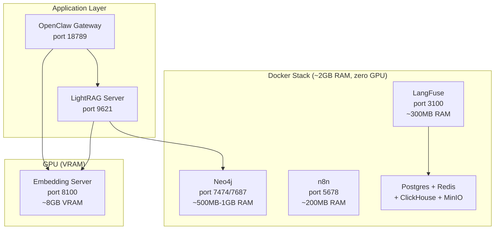

# Part 20: Agent Observability & Infrastructure Services

*See what your agents are actually doing. Connect to 400+ apps. Make search 40% better.*

---

## The Observability Problem

Running multiple agents without observability is flying blind. You don't know:
- How much each agent costs per day
- Which agents fail silently
- Where latency bottlenecks are
- Whether your search is returning relevant results

## LangFuse — Agent Tracing

[LangFuse](https://langfuse.com) is open-source LLM observability. Self-host it in Docker for free.

### Setup


## ClawClip — Session Replay & Cost Analysis

Before setting up full observability infrastructure, start with [ClawClip](https://github.com/Ylsssq926/clawclip) — a local web app that reads your OpenClaw/ZeroClaw session logs and shows you exactly where tokens are going.

### What It Does

ClawClip gives you three views of each run:

1. **Run Insights (Replay)** — Step through what your agent actually did: every tool call, retry, reasoning block, and response, in order. Find where it went sideways without digging through raw JSONL.

2. **Agent Scorecard (Benchmark)** — Six-dimension verdict after each run (writing, code, tool use, retrieval, safety, cost-efficiency). When you make a change, you get before/after proof: score, tokens, cost.

3. **Cost Report** — Breaks spend by model, task, and session. Flags retry loops, context bloat, prompt inefficiency, and model mismatches. Tells you which changes are most likely to cut cost without hurting quality.

### Setup

```bash
git clone https://github.com/Ylsssq926/clawclip.git
cd clawclip && npm install
npm start
# → http://localhost:8080
```

ClawClip auto-discovers `~/.openclaw/` sessions. For custom paths:

```bash
CLAWCLIP_LOBSTER_DIRS=/path/to/your/sessions npm start
```

### Why Start Here

- **Zero infrastructure** — no Docker, no databases, just reads local logs
- **Immediate value** — see where money's going in 2 minutes
- **Answers the key question** — did my agent get better, or just more expensive?

Once you're running multiple agents or need real-time tracing, add LangFuse below. But for single-agent optimization, ClawClip is often enough.

---

```yaml
# docker-compose.yml (simplified)
services:
  langfuse-web:
    image: langfuse/langfuse:3
    ports:
      - "3100:3000"
    depends_on:
      - postgres
  postgres:
    image: postgres:16
    environment:
      POSTGRES_PASSWORD: postgres
```

```bash
docker compose up -d
# Dashboard at http://localhost:3100
```

### What You Get
- **Traces** — every LLM call logged with input, output, tokens, latency, cost
- **Cost tracking** — per agent, per model, per provider, per day
- **Failure detection** — find errors, timeouts, and silent failures
- **Performance metrics** — average latency, token patterns, model comparison

> LangFuse runs at localhost:3100 — self-hosted, all data stays on your machine. Once you start tracing agent calls, the dashboard shows costs, latency, errors, and token usage across all your agents.

### OpenClaw Integration

Add tracing via the LangFuse Python SDK in your scripts, or use the REST API:

```python
from langfuse import Langfuse
langfuse = Langfuse(host="http://localhost:3100")
trace = langfuse.trace(name="vault-query", user_id="ops-agent")
```

LightRAG has built-in LangFuse integration — enable it in your `.env` and all graph RAG operations are automatically traced.

---

## Reranker — Better Search Quality

A reranker re-scores retrieval results after initial vector search. It catches cases where keyword match matters more than semantic similarity.

### Setup

Install a small cross-encoder model alongside your embedding server:

```python
# reranker-server.py (FastAPI)
from sentence_transformers import CrossEncoder

model = CrossEncoder("cross-encoder/ms-marco-MiniLM-L-6-v2")
# ~50MB VRAM, runs on any GPU with headroom

# POST /v1/rerank
# Input: {"query": "...", "documents": ["...", "..."], "top_n": 5}
# Output: reranked documents with scores
```

### Impact
- **20-40% better search relevance** on retrieval benchmarks
- **~50MB VRAM** (tiny — runs alongside any embedding model)
- **<400ms latency** for reranking 10 documents

### Integration
Add reranking between initial retrieval and final results:
```
Query → Embedding → Top-50 → Reranker → Top-5 (much better quality)
```

LightRAG supports rerankers natively — configure in `.env`.

---

## n8n — Workflow Automation

[n8n](https://n8n.io) is a self-hosted workflow automation platform with 400+ app integrations.

### Setup

```yaml
services:
  n8n:
    image: n8nio/n8n
    ports:
      - "5678:5678"
    volumes:
      - ./n8n-data:/home/node/.n8n
```

```bash
docker compose up -d
# Dashboard at http://localhost:5678
```

### Why It Matters
Instead of building custom integrations for every external service, n8n gives you drag-and-drop connections to Notion, Airtable, Stripe, Linear, Slack, Discord, Google Sheets, and 400+ more.

### OpenClaw Integration

**Agent → n8n:** Your agent triggers an n8n workflow via webhook:
```powershell
Invoke-RestMethod -Uri "http://localhost:5678/webhook/your-workflow-id" -Method POST -Body '{"data":"..."}'
```

**n8n → Agent:** An n8n workflow triggers your agent via the OpenClaw API.

### Starter Workflow Ideas
1. **Morning Briefing** — aggregate email + calendar + GitHub notifications → summarize → send to agent
2. **PR Auto-Review** — GitHub webhook → fetch PR → agent reviews → posts comment
3. **Content Pipeline** — new idea → research agent → draft → review → schedule

---

## The Full Services Stack

All services run in Docker on your main machine. Zero GPU usage — all CPU + RAM.



Your GPU is untouched by Docker — only the embedding server uses VRAM (~8GB).

---

## Checklist

- [ ] LangFuse deployed in Docker (port 3100)
- [ ] LangFuse dashboard accessible, first traces visible
- [ ] Reranker model downloaded and serving (port 8101 or similar)
- [ ] Reranker integrated into retrieval pipeline
- [ ] n8n deployed in Docker (port 5678)
- [ ] At least one n8n workflow connected to OpenClaw
- [ ] Neo4j deployed for LightRAG graph storage (port 7474)
- [ ] All services persistent (data volumes configured)
