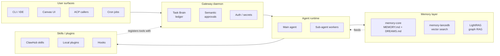
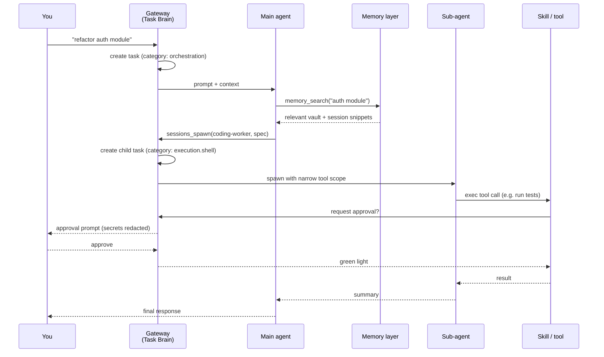

# Part 25: Architecture Overview (v4.0+)

> New primer in the 2026.4.15-beta.1 refresh. If you came in after v4.0 shipped, the architecture underneath OpenClaw is probably different from the one you learned. This part is the shortest possible map of how the current system actually fits together \u2014 read it once, then the rest of the guide makes more sense.

## The Five Moving Parts

Every OpenClaw install since v4.0 has the same five major components. Most of the guide is "how to configure one of these better," so it helps to know what they are:

### 1. The Gateway Daemon

The single long-running process that every surface talks to. Holds the Task Brain ledger, auth tokens, approval policy, and the in-memory model of what's running right now.

- Before v4.0: multiple processes (session manager, cron worker, ACP server) each with their own state.
- v4.0+: one gateway. Everything else is a client.
- [Part 15](./part15-infrastructure-hardening.md) covers the failure modes: crash loops, stale processes, auth hot-reload.

If the gateway is the heart, Task Brain ([Part 24](./part24-task-brain-control-plane.md)) is the nervous system that everything else plugs into.

### 2. Agent Runtime

The thing that actually runs a model and pushes a conversation forward. Two shapes:

- **Main agent** \u2014 your interactive session. High-quality model, full tool access, human in the loop.
- **Sub-agent workers** \u2014 spawned via `sessions_spawn`. Cheaper/faster model, narrower tool scope, no interactive input. [Part 5](./README.md#part-5-orchestration) is the full pattern.

All spawns go through the Task Brain ledger now \u2014 meaning you can see, audit, and revoke them in one place.

### 3. Memory Layer

Three stores with different jobs. They're complementary, not alternatives:

| Store | What it holds | When agent reads it | Part |
|-------|---------------|---------------------|------|
| **memory-core** (MEMORY.md + DREAMS.md) | Canonical human-readable index + dream diary | Injected on every message | [4](./README.md#part-4-memory-stop-forgetting-everything), [22](./README.md#part-22-built-in-dreaming) |
| **memory-lancedb** | Vector index over session files + vault | `memory_search` tool call | [4](./README.md#part-4-memory-stop-forgetting-everything), [10](./part10-state-of-the-art-embeddings.md) |
| **LightRAG** | Knowledge graph (entities + relationships) | Graph queries on complex questions | [18](./part18-lightrag-graph-rag.md), [21](./part21-realtime-knowledge-sync.md) |

The vault ([Part 9](./part9-vault-memory.md)) is the filesystem layout that makes all three of these useful \u2014 it's not a fourth store, it's the structure they all index over.

### 4. Skills / Plugins

Where agent capabilities come from. Three sources:

- **ClawHub skills** \u2014 community marketplace. High capability, high attack surface. [Part 23](./part23-clawhub-skills-marketplace.md).
- **Local plugins** \u2014 things you wrote or configured directly in `openclaw.json`.
- **Hooks** \u2014 lifecycle callbacks (session-start, session-end, etc.). The auto-capture hook ([Part 11](./part11-auto-capture-hook.md)) and the file watcher ([Part 21](./part21-realtime-knowledge-sync.md)) are the two most useful.

All three register tools with the gateway, which classifies them into semantic approval categories ([Part 24](./part24-task-brain-control-plane.md)).

### 5. User Surfaces

The things you, a human, actually click or type in:

- **CLI / IDE** \u2014 `openclaw` commands, editor integrations.
- **Canvas UI** \u2014 the browser UI introduced in v4.0. Interactive chat + task ledger view + Model Auth status card (new 2026.4.15-beta.1).
- **ACP callers** \u2014 anything that calls into an agent procedure programmatically (webhooks, scripts, other agents).
- **Cron jobs** \u2014 scheduled runs. Native in v4.0+ (was a plugin before).

All four surfaces are interchangeable from the gateway's point of view \u2014 they all produce Task Brain tasks.

## What Changed In Each Major Version

Short form, so you know what era a given piece of advice applies to:

| Version | Date | Headline change | Why you care |
|---------|------|-----------------|--------------|
| **v3.x** | pre-2026 | Multiple processes, plugin-based cron | Legacy. Most of this guide does not apply. |
| **v4.0** | early 2026 | Ground-up rewrite: gateway daemon, Canvas UI, native cron, 15+ messaging platforms | The architecture the rest of this guide assumes. |
| **v4.1 / ClawHub** | 2026-03-15 | Official skills marketplace | 13K+ skills in a month, also 1,184 malicious ones. See [Part 23](./part23-clawhub-skills-marketplace.md). |
| **v2026.3.31-beta.1** | 2026-03-31 | Task Brain control plane + semantic approvals | Structural response to March CVE wave. See [Part 24](./part24-task-brain-control-plane.md). |
| **v2026.4.x** | 2026-04 | memory-core built-in dreaming; plus rolling fixes | Part 22 replaces the custom autoDream from Part 16. |
| **v2026.4.15-beta.1** | 2026-04-15 | memory-lancedb cloud storage, Copilot embeddings, `localModelLean`, compaction reserve-token cap, gateway auth hot-reload, approvals secret redaction, `memory_get` canonical-only | This guide's current baseline. |

If you're on something older than v4.0, the first upgrade is not reading this guide \u2014 it's moving to v4.0+. See [Part 26 \u2014 Migration Guide](./part26-migration-guide.md).

## The Data Flow Of A Typical Request

A user-visible request like "refactor this module" goes through all five components:

Every arrow in that diagram is a point where you can configure something that this guide covers:

- The gateway \u2014 context pruning, compaction, auth, approval policy.
- The main agent \u2014 model, reasoning mode, orchestration rules.
- Memory \u2014 which embeddings, how big the vault, do you have LightRAG.
- The spawn \u2014 what worker model, what tool scope, what approval categories.
- The tool \u2014 which skills, how trusted, how scoped.

Knowing which arrow you're tuning is usually more important than knowing which specific flag to flip.

## How To Use The Rest Of This Guide

The guide is not a linear book. It's a set of plays you pull from depending on what you're optimizing:

- **"My agent is slow."** \u2192 Parts 1, 2, 3, 6.
- **"My agent keeps forgetting things."** \u2192 Parts 4, 9, 10, 22.
- **"My agent is expensive."** \u2192 Parts 5, 6, 8.
- **"My agent is not safe enough for real work."** \u2192 Parts 15, 23, 24.
- **"My agent doesn't understand my codebase."** \u2192 Parts 18, 19, 21.
- **"I can't see what my agent is doing."** \u2192 Part 20 + Task Brain audit from Part 24.
- **"I'm upgrading from an older version."** \u2192 Part 26 first, then the above.
- **"Something weird is happening."** \u2192 Part 27 (gotchas / FAQ).

Read this part once, keep the table of contents in the README open, and pull parts as needed.
