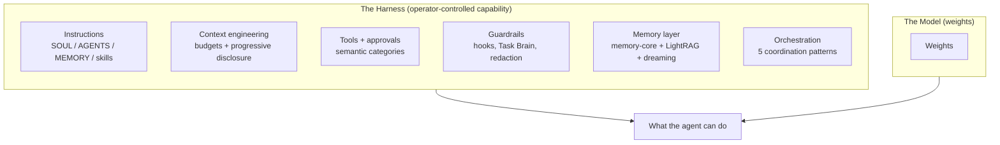
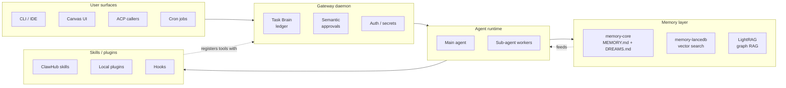
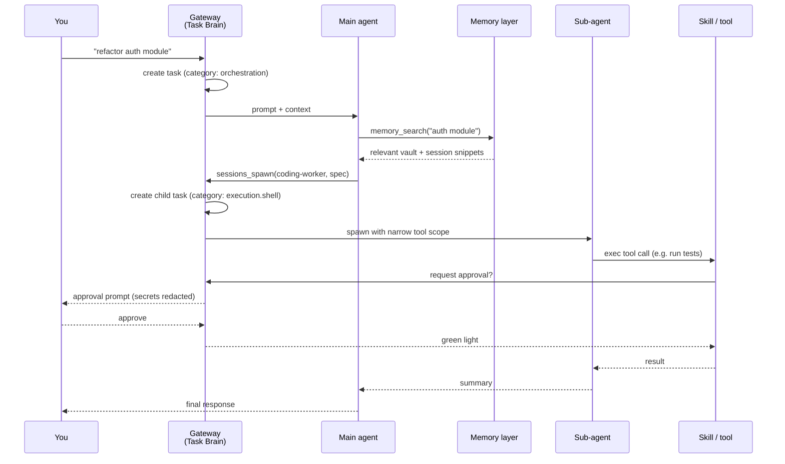

# Part 25: Architecture Overview (v4.0+)

> New primer in the 2026.4.15 refresh. If you came in after v4.0 shipped, the architecture underneath OpenClaw is probably different from the one you learned. This part is the shortest possible map of how the current system actually fits together — read it once, then the rest of the guide makes more sense.

> **Read this if** you're newish to OpenClaw v4.0+, or you've been following the guide part-by-part without a map of where each piece fits.
> **Skip if** you already know the gateway daemon / Canvas / memory-core / Task Brain / ClawHub pieces and just want to tune a specific one — jump straight to the targeted part.

## The Harness Thesis

> **Most agent capability comes from the harness, not the weights.**

The exact 95/5 split was always a mnemonic, not a law. The useful part survived the late-April/May release waves: changing weights helps, but the big operator wins come from context budgets, memory discipline, provider routing, hooks, approvals, run steering, and verification.

OpenClaw is a harness. This guide is the operator's manual for that harness. Every part that follows — the five moving parts below, and the rest of the guide — is about configuring one axis of the operator-controlled layer.

If you take one idea from this guide: **the model you pick is the smallest lever. The harness is the system.**

## The Five Moving Parts

Every OpenClaw install since v4.0 has the same five major components. Most of the guide is "how to configure one of these better," so it helps to know what they are:

### 1. The Gateway Daemon

The single long-running process that every surface talks to. Holds the Task Brain ledger, auth tokens, approval policy, and the in-memory model of what's running right now.

- Before v4.0: multiple processes (session manager, cron worker, ACP server) each with their own state.
- v4.0+: one gateway. Everything else is a client.
- [Part 15](./part15-infrastructure-hardening.md) covers the failure modes: crash loops, stale processes, auth hot-reload.

If the gateway is the heart, Task Brain ([Part 24](./part24-task-brain-control-plane.md)) is the nervous system that everything else plugs into.

### 2. Agent Runtime

The thing that actually runs a model and pushes a conversation forward. Two shapes:

- **Main agent** — your interactive session. High-quality model, full tool access, human in the loop.
- **Sub-agent workers** — spawned via `sessions_spawn`. Cheaper/faster model, narrower tool scope, no interactive input. [Part 5](./README.md#part-5-orchestration-stop-doing-everything-yourself) is the full pattern.

All spawns go through the Task Brain ledger now — meaning you can see, audit, and revoke them in one place.

### 3. Memory Layer

Three stores with different jobs. They're complementary, not alternatives:

| Store | What it holds | When agent reads it | Part |
|-------|---------------|---------------------|------|
| **memory-core** (MEMORY.md + DREAMS.md) | Canonical human-readable index + dream diary | Injected on every message | [4](./README.md#part-4-memory-stop-forgetting-everything), [22](./README.md#part-22-built-in-dreaming) |
| **memory-lancedb** | Vector index over session files + vault | `memory_search` tool call | [4](./README.md#part-4-memory-stop-forgetting-everything), [10](./part10-state-of-the-art-embeddings.md) |
| **LightRAG** | Knowledge graph (entities + relationships) | Graph queries on complex questions | [18](./part18-lightrag-graph-rag.md), [21](./part21-realtime-knowledge-sync.md) |

The vault ([Part 9](./part9-vault-memory.md)) is the filesystem layout that makes all three of these useful — it's not a fourth store, it's the structure they all index over.

### 4. Skills / Plugins

Where agent capabilities come from. Three sources:

- **ClawHub skills** — community marketplace. High capability, high attack surface. [Part 23](./part23-clawhub-skills-marketplace.md).
- **Local plugins** — things you wrote or configured directly in `openclaw.json`.
- **Hooks** — lifecycle callbacks (session-start, session-end, etc.). The auto-capture hook ([Part 11](./part11-auto-capture-hook.md)) and the file watcher ([Part 21](./part21-realtime-knowledge-sync.md)) are the two most useful.

All three register tools with the gateway, which classifies them into semantic approval categories ([Part 24](./part24-task-brain-control-plane.md)).

### 5. User Surfaces

The things you, a human, actually click or type in:

- **CLI / IDE** — `openclaw` commands, editor integrations.
- **Canvas UI** — the browser UI introduced in v4.0. Interactive chat + task ledger view + Model Auth status card (new 2026.4.15).
- **ACP callers** — anything that calls into an agent procedure programmatically (webhooks, scripts, other agents).
- **Cron jobs** — scheduled runs. Native in v4.0+ (was a plugin before).

All four surfaces are interchangeable from the gateway's point of view — they all produce Task Brain flows.

## What Changed In Each Major Version

Short form, so you know what era a given piece of advice applies to:

| Version | Date | Headline change | Why you care |
|---------|------|-----------------|--------------|
| **v3.x** | pre-2026 | Multiple processes, plugin-based cron | Legacy. Most of this guide does not apply. |
| **v4.0 — "The Agent OS"** | 2026-02-20 | Ground-up rewrite: gateway daemon, Canvas UI, native cron scheduling, 15+ messaging platforms (WhatsApp, Telegram, Discord, Slack, iMessage, WeChat, Line, Signal, Matrix, Teams…), new plugin API | The architecture the rest of this guide assumes. |
| **v4.1 — ClawHub** | 2026-03-15 | Official skills marketplace, Claude Code ACP harness, Soul.md semantic memory | 13K+ skills in a week; also the ClawHavoc supply-chain incident (1,184 malicious skills confirmed by Antiy CERT). See [Part 23](./part23-clawhub-skills-marketplace.md). |
| **v4.2 — ACP** | 2026-03-28 | Agent Communication Protocol, thread-bound persistent sessions, sub-agent spawning, `session_status` tool | Protocol-level multi-agent plumbing. |
| **v2026.3.31-beta.1 — Task Brain** | 2026-03-31 | Control plane, semantic approval categories, fail-closed plugin installs, gateway auth tightening | Structural response to the Feb–Mar CVE wave. See [Part 24](./part24-task-brain-control-plane.md). |
| **v2026.4.x** | early 2026-04 | memory-core built-in dreaming; rolling fixes | Part 22 replaces the custom autoDream pattern. |
| **v2026.4.15-beta.1** | 2026-04-15 | memory-lancedb cloud storage, GitHub Copilot embedding provider, `agents.defaults.experimental.localModelLean`, compaction reserve-token cap, `models.authStatus` gateway method + Canvas Model Auth card, approvals secret redaction, `memory_get` canonical-only | Where the 4.15 line starts. |
| **v2026.4.15 (stable)** | 2026-04-16 | Claude **Opus 4.7** new Anthropic default; dreaming default `inline` → `separate` (phase blocks to `memory/dreaming/{phase}/YYYY-MM-DD.md`); `memory_get` default excerpt cap + continuation metadata; trimmed startup/skills prompt budgets; gateway tool-name normalize-collision rejection (closes local-media trust inheritance); webchat localRoots containment; Gemini TTS in bundled `google` plugin; Matrix pairing-auth tightening | Stable-promotes 4.15-beta.1 plus new features. |
| **v2026.4.20–4.22** | 2026-04-20/22 | Session-store pruning, Kimi K2.6 bundled Moonshot default, tiered token reports, `/models add`, and OpenAI Codex auth import | Important historically, but `/models add` and Codex auth import were quickly superseded. |
| **v2026.4.24 beta** | 2026-04-24 | Google Meet recovery, realtime voice consults, DeepSeek V4, browser coordinate clicks, 60s browser budgets, per-profile headless overrides, manifest-backed model rows, `/models add` deprecation | The provider-catalog/browser automation line begins here. |
| **v2026.4.27 stable** | 2026-04-27 | DeepInfra provider, Codex Computer Use setup/status/install, manifest-first plugin catalogs, Docker GPU passthrough, outbound proxy routing, non-image chat attachments | Late-April stable baseline; required before the May migration makes sense. |
| **v2026.4.29-beta.1** | 2026-04-29 | Active-run steering, visible-reply enforcement, people-aware wiki metadata, Active Memory chat filters, partial recall on timeout, NVIDIA provider, Bedrock Opus 4.7 parity, OpenGrep scanning | Memory + messaging beta that shaped the May defaults. |
| **v2026.5.12 stable** | 2026-05-14 | Leaner externalized provider/channel installs, Telegram resilience, Codex app-server/runtime fallback fixes, pnpm 11 plugin install support, ACP fallbacks, Control UI/WebChat/TUI delivery polish, broad gateway/browser/Slack/sandbox/transcript hardening | **This guide's current stable baseline.** |
| **v2026.5.14-beta.1** | 2026-05-14 | `/queue steer` default, `agents.defaults.runRetries`, Telnyx realtime calls, Codex command/migration fixes, bundled `codex-cli` backend removal/repair, WhatsApp status reactions, per-sender tool policies, nested sub-agent sessions | Latest beta; test on a copied profile before exposing to users. |

If you're on something older than v4.0, the first upgrade is not reading this guide — it's moving to v4.0+. See [Part 26 — Migration Guide](./part26-migration-guide.md).

## The Data Flow Of A Typical Request

A user-visible request like "refactor this module" goes through all five components:

Every arrow in that diagram is a point where you can configure something that this guide covers:

- The gateway — context pruning, compaction, auth, approval policy.
- The main agent — model, reasoning mode, orchestration rules.
- Memory — which embeddings, how big the vault, do you have LightRAG.
- The spawn — what worker model, what tool scope, what approval categories.
- The tool — which skills, how trusted, how scoped.

Knowing which arrow you're tuning is usually more important than knowing which specific flag to flip.

## How To Use The Rest Of This Guide

The guide is not a linear book. It's a set of plays you pull from depending on what you're optimizing:

- **"My agent is slow."** \u2192 Parts 1, 2, 3, 6.
- **"My agent keeps forgetting things."** \u2192 Parts 4, 9, 10, 22.
- **"My agent is expensive."** \u2192 Parts 5, 6, 8.
- **"My agent is not safe enough for real work."** \u2192 Parts 15, 23, 24.
- **"My agent doesn't understand my codebase."** \u2192 Parts 18, 19, 21.
- **"I can't see what my agent is doing."** \u2192 Part 20 + Task Brain audit from Part 24.
- **"I'm upgrading from an older version."** \u2192 Part 26 first, then the above.
- **"Something weird is happening."** \u2192 Part 27 (gotchas / FAQ).

Read this part once, keep the table of contents in the README open, and pull parts as needed.
